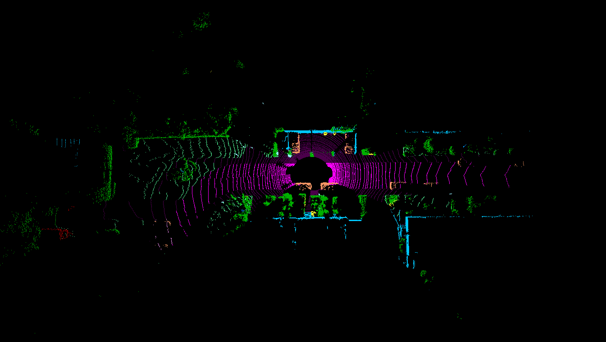
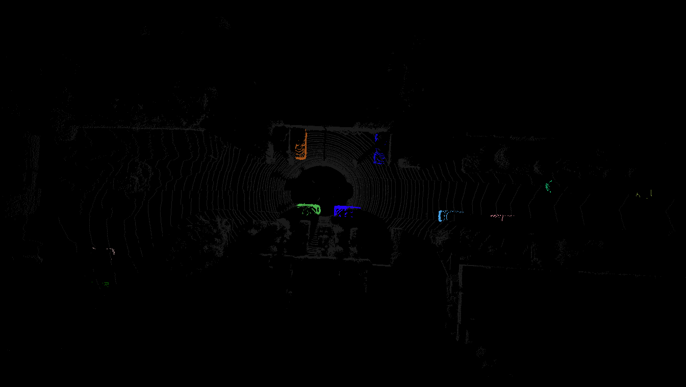

# PanopticPolarNet

## Environment:

Run docker:
- docker-compose -f ./docker-compose.yaml build
- docker-compose -f ./docker-compose.yaml run --rm workspace 

Run jupyter inside docker:
- jupyter notebook --ip 0.0.0.0 --no-browser --allow-root

Forward X11 inside docker:
- xhost +local:docker

## Usage:

TODO: arguments

Train:
`python3 -m panoptic_polarnet.train` 

Evaluate:
`python3 -m panoptic_polarnet.test_pretrain` 

Inference:
`python3 -m panoptic_polarnet.inference` 

Visualize:s
`python3 -m panoptic_polarnet.visualize_pointclouds` 

Visualization example:

|        labels  semantic          |       labels   instance           |
| -------------------------------- | --------------------------------- | 
|    |     |

## TODO:

Experiments results:
[click](https://open-cake-264.notion.site/Panoptic-Generiaize-Adaptation-198b71e03cc44465868576c1a0d53481?pvs=4)

- [x] Visualize pointcloud: frame
- [x] Visualize pointcloud: sequence
- [x] Visualize labels and predictions with different colors
- [x] Run inference on one frame on torch (visualize predictions + get fps)
- [ ] Convert model to onnx and run inference on it +/-
- [ ] Run training +/-
- [ ] Analyze current performance +/- with different conditions

- [ ] Run inference on sequence with ros?

